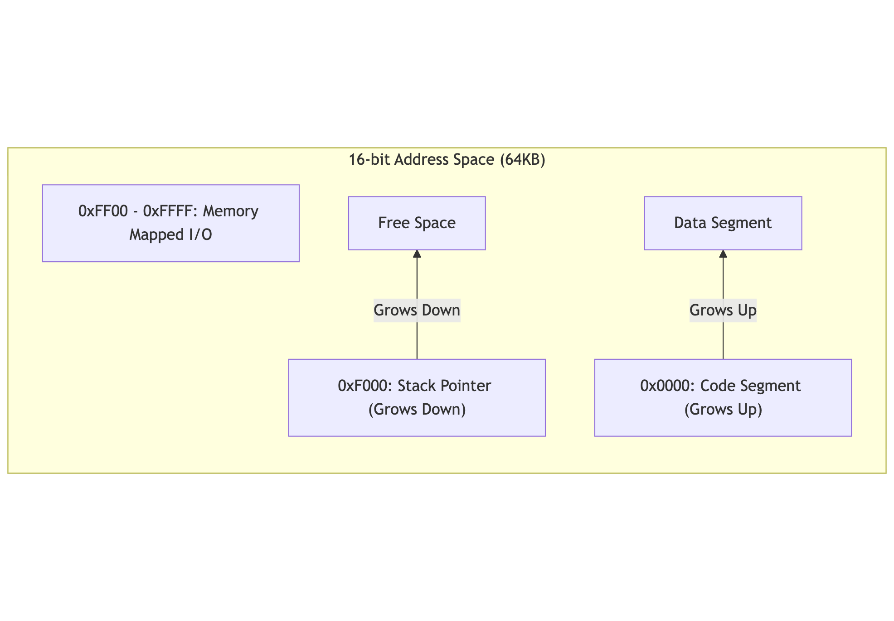
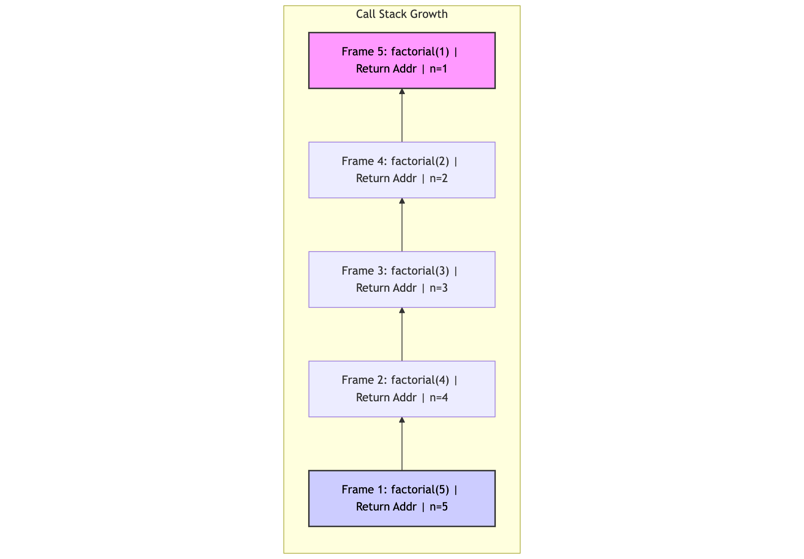

# Program Layout & Execution Report

**Team Members:**
- Priyanshu Patel
- Meet Hitesh Thakkar
- Yash Bharatbhai Savani
- Puneeth Regonda


## GitHub Repository
Link to GitHub Repository: https://github.com/priyanshu1044/part2_program_layout

## How to Download, Compile, and Run

### Prerequisites
- A C++ Compiler (g++ recommended)
- Make (optional)

### Instructions
1.  **Download**: Clone the repository.
    ```bash
    git clone https://github.com/priyanshu1044/part2_program_layout
    cd part2_program_layout
    ```

2.  **Compile**:
    ```bash
    make clean && make
    ```

3.  **Assemble Program**:
    ```bash
    ./assembler programs/factorial.asm factorial.bin
    ```

4.  **Run Program**:
    ```bash
    ./cpu factorial.bin
    ```
    *Output should be 120 (which is 5!).*

## Team Contributions
- **Priyanshu Patel**: Lead developer for the CPU instruction set extension. Implemented the critical stack manipulation instructions (`PUSH`, `POP`, `CALL`, `RET`) and the multiplication instruction (`MUL`) in C++. Also developed the core assembly logic for the recursive factorial algorithm.
- **Meet Hitesh Thakkar**: Architected the memory management strategy, specifically defining the stack frame structure and memory map layout. Ensured proper stack growth direction (descending from 0xF000) and managed register preservation conventions during function calls.
- **Yash Bharatbhai Savani**: Responsible for quality assurance and documentation. Rigorously tested the recursion depth and stack pointer behavior to prevent overflows. Produced the final project report and the educational video demonstrating the step-by-step execution of the function calls.
- **Puneeth Regonda**: Developed the high-level reference implementation in C (`programs/factorial.c`) to serve as a verification baseline. Assisted in cross-referencing the assembly output against the C program's logic to ensure algorithmic correctness.

## Memory Layout & Recursion

### Memory Layout
### Memory Layout Diagram


### Memory Segments
The Software CPU uses a 16-bit address space (64KB):
- **0x0000 - 0xEFFF**: Program Code & Data. The program starts at 0x0000.
- **0xF000**: Initial Stack Pointer. The stack grows **downwards** from this address towards the data segment.
- **0xFF00 - 0xFF01**: Memory Mapped I/O. Writing to `0xFF01` prints integers, `0xFF00` prints characters.


### Recursion Stack Diagram
This diagram shows how the stack grows as `factorial(5)` calls `factorial(4)` and so on.



### Function Calls & Recursion
The `FACTORIAL` function demonstrates recursion using the Stack:
1.  **CALL Instruction**: Pushes the Return Address (PC) onto the Stack and jumps to the function.
2.  **Stack Frame**: Each function call creates a frame:
    - **Return Address**: Saved by `CALL`.
    - **Saved Registers**: `PUSH R1` saves the callee-saved register.
    - **Local Variables**: `PUSH R0` saves the argument `n` across recursive calls.
3.  **Recursion**: The function calls itself (`CALL FACTORIAL`) until the base case (`n=1`) is reached.
4.  **Unwinding**: `RET` pops the Return Address and jumps back, while `POP` restores registers, allowing the calculation to proceed up the chain.

### Demo Video

